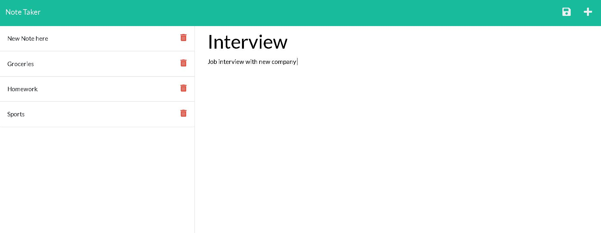

# Note Taker Application

# Description

Note Taker is a simple application that allows the user to create new notes and save them for later viewing. Each note has a title that is displayed for easy viewing and access. 

## Installation

This app is deployed on Heroku, so just be sure you have access to it if you want to use Note Taker. 

## Usage

This is a note taking application.

## Screenshots of App

The following images show the web application's appearance and functionality:

## Heroku Deployment

https://note-taker-djm.herokuapp.com/
